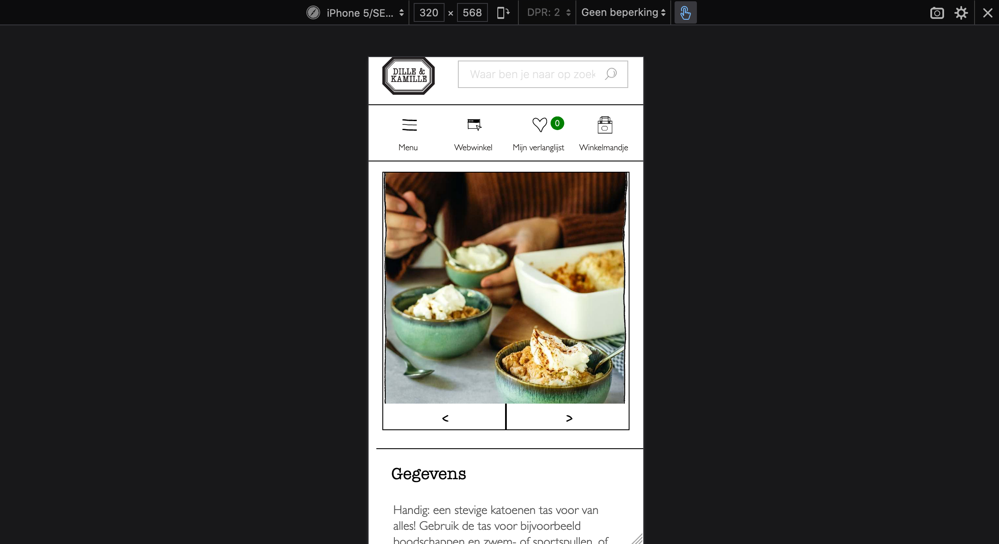

# Procesverslag
**Auteur:** Channah Kuipers

## Bronnenlijst
afbeeldingen & content: dille-kamille.nl
socialmedia iconen: simpleicons.org en icons8.com

1. Plaatsing button in de zoekbalk
[https://www.w3schools.com/howto/howto_css_search_button.asp](https://www.w3schools.com/howto/howto_css_search_button.asp)

2. Plaatjes naast tekst plaatsen
[https://www.w3schools.com/css/css_float.asp](https://www.w3schools.com/css/css_float.asp)

3. flex objecten in andere positie plaatsen
[https://css-tricks.com/snippets/css/a-guide-to-flexbox/](https://css-tricks.com/snippets/css/a-guide-to-flexbox/)

4. Fotobladeren js
Code afgeleid van Fotoboek-opdracht, programmeren.

5. Schaduw om inschrijven-button
[https://developer.mozilla.org/en-US/docs/Web/CSS/box-shadow]([https://developer.mozilla.org/en-US/docs/Web/CSS/box-shadow])

6. Plaatsing plaatje van winkel en vierkant maken
[https://stackoverflow.com/questions/15167545/](https://stackoverflow.com/questions/15167545/)
[how-to-crop-a-rectangular-image-into-a-square-with-css](how-to-crop-a-rectangular-image-into-a-square-with-css)
[https://developer.mozilla.org/en-US/docs/Web/HTML/Element/picture](https://developer.mozilla.org/en-US/docs/Web/HTML/Element/picture)

7. Mircointeractie: hartje
[https://codepen.io/shooft/pen/poyaJpa](https://codepen.io/shooft/pen/poyaJpa)

8. Animatie: winkel plaatje laten draaien
[https://codepen.io/shooft/pen/xxVmpEP](https://codepen.io/shooft/pen/xxVmpEP)

----------------------------------------------
## Eindgesprek (week 7/8)
-dit ging goed & dit was lastig-
HTML en CSS schrijven gaat nu veel makkelijker, ik hoef minder naar specifieke codes te zoeken om een CSS stijl toe te passen. Verder had ik veel moeite met het maken van de micro-interactie en ik wilde ook een clickbare foto album maken, na veel dingen te hebben geprobeert ben ik maar een makkelijkere alternatief overgestapt. Ik ben uiteindelijk wel trost wat ik heb neergezet :)

**Screenshot(s):**
-screenshot(s) van je eindresultaat-

---------------------------------------------
## Voortgang 3 (week 6)

### Stand van zaken
-dit ging goed & dit was lastig-
Ik heb vanaf vorige voortgang vooral gewerkt aan de styling van mijn site. Iconen en afbeeldingen plaatsen.
Elementen schalen en positioneren vind ik nog wel lastig en was daar wel veel tijd aan kwijt. 

**Screenshot(s):**
-screenshot(s) van hoe ver je bent-

### Agenda voor meeting
-samen met je groepje opstellen-
- Gallery
- Toegankelijkheid
- JavaScript

---------------------------------------------
## Voortgang 2 (week 5)

### Stand van zaken
-dit ging goed & dit was lastig-
Het schrijven van code gaat beter. Stylen gaat goed. Wel moet ik meer gaan letten hoe ik de code op de beste manier moet opbouwen. Voor mijn gevoel moet ik te veel losse elementen stylen terwijl dat ook anders kan. Ik moet nog veel werk doen om bij te blijven.

**Screenshot(s):**
-screenshot(s) van hoe ver je bent-

### Agenda voor meeting
-samen met je groepje opstellen-
- Grid
- JavaScript
- Hamburgermenu

----------------------------------------------
## Voortgang 1 (week 3)

### Stand van zaken
-dit ging goed & dit was lastig-
Ik vindt het nog lastig om de content op de juiste plek te plaatsen doormiddel van CSS. Verder vind ik de semantiek van elementen ook nog lastig (welk onderdeel, moet binnen een ander onderdeel bevinden).

**Screenshot(s):**
-screenshot(s) van hoe ver je bent-
Ik had nog niet veel gemaakt, dus ook geen screenshots van mijn site.

### Agenda voor meeting
-samen met je groepje opstellen-
- Carrousel
- Display flex
- Scroll snap
- CSS overflow

### Verslag van meeting
-na afloop snel uitkomsten vastleggen-
Ik was zelf nog niet ver met mijn site. Ik ben bij andere in het groepje gaan kijken hoe hun het aan hadden gepakt en daar vervolgens aantekeningen voor mijn eigen site ging maken.

--------------------------------------------
## Intake (week 1)

**Je startniveau:** -kies uit zwart, rood óf blauw-
Blauw piste, Ik vindt coderen nog best lastig vooral de code semantiek is.

**Je focus:** -kies uit responsive óf surface plane-
Ik ga voor surface.

**Je opdracht:** -link naar de website die je gaat namaken óf de naam van je eigen ontwerp- https://www.dille-kamille.nl/

**Screenshot(s):**

**Breakdown-schets(en):**

